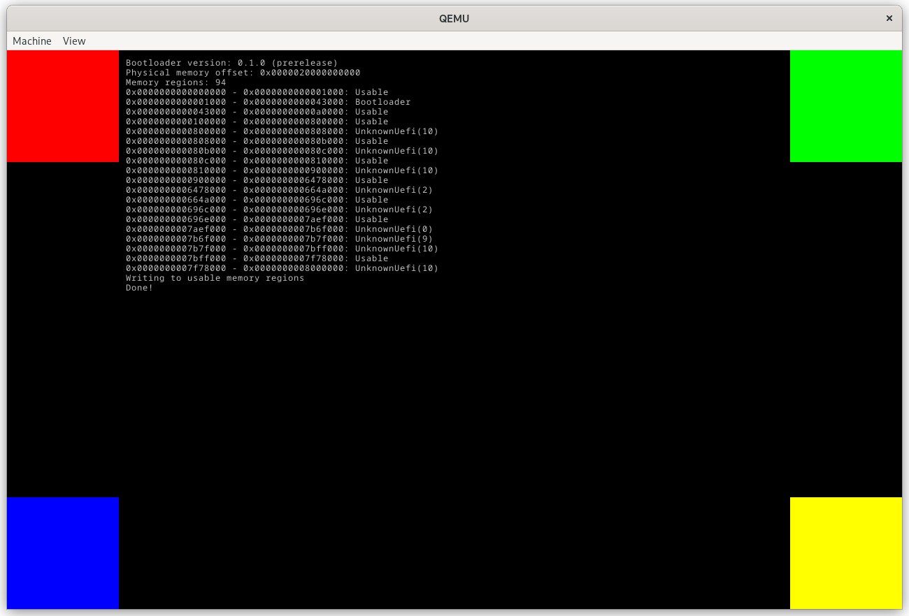

# test kernel

This repo implements a simple kernel that can be used for testing https://github.com/rust-osdev/bootloader.

## Building an image

Run this command will build the kernel, it's built on target `x86_64-unknown-none`, if you encounter error
like target `x86_64-unknown-none` not installed, try run `rustup target add x86_64-unknown-none`

```shell
$ cargo build
```

Run this command to build an image and start it in qemu. Make sure you already have the test-kernel built.
The default kernel path is `target/x86_64-unknown-none/debug/test-kernel`, if the file not exists, try build
it, if the kernel is anywhere else, try set `KERNEL_PATH` environment variable.

```shell
$ cargo run -p runner
```

This command will prepend a bootloader to the kernel and generate a disk image at `target/uefi.img`.
This image can be tested on qemu or can be flashed onto a USB flash drive for testing with real hardware.

## Expected output

The test kernel will do the following things:
- Clear the framebuffer.
- Draw a colored square into each corner of the screen to test if the framebuffer information provided by the bootloader is correct
- Log the bootloader version
- Log the offset of the physical memory mapping created by the bootloader
- Log the memory map provided by the bootloader
- Attempt to write all usable memory to check if the memory map is correct

Last but not least, the test kernel will log "Done". If this message isn't logged one of the tests caused a crash.



Log messages will be displayed on the framebuffer (if one exists) and written to the first serial port.